<div align="center">

<!-- ═══════════════════════════════════════════════════════════
     CONTRIBUTION GRAPH
════════════════════════════════════════════════════════════ -->

<h4><code>charan@github ~ $ ./contributions.sh</code></h4>



<br>

<!-- ═══════════════════════════════════════════════════════════
     WHOAMI — ASCII PORTRAIT + INFO CARD
════════════════════════════════════════════════════════════ -->

<h4><code>charan@github ~ $ whoami</code></h4>

<table>
<tr>
<td valign="top" width="370">

</td>
<td valign="top" width="490">

</td>
</tr>
</table>

<br>

<!-- ═══════════════════════════════════════════════════════════
     PROJECTS
════════════════════════════════════════════════════════════ -->

<h4><code>charan@github ~ $ ls ./projects</code></h4>

</div>

---

### [Dheerah Prahari](https://github.com/charansaiyalla/dheerah-prahari)
> **Stack:** React Native &nbsp;·&nbsp; Node.js &nbsp;·&nbsp; PostgreSQL &nbsp;·&nbsp; Supabase &nbsp;·&nbsp; Prisma &nbsp;·&nbsp; JWT
- **Description:** Anti-drug awareness and wellness management mobile application and backend platform.
- **Key Features:** Role-based authentication, interactive Telangana district analytics map, incident reporting, and real-time wellness tracking.
- **Repository:** [`github.com/charansaiyalla/dheerah-prahari`](https://github.com/charansaiyalla/dheerah-prahari)

---

### [MiniRedis](https://github.com/charansaiyalla/MiniRedis)
> **Stack:** C &nbsp;·&nbsp; CMake &nbsp;·&nbsp; Systems Programming &nbsp;·&nbsp; POSIX Sockets
- **Description:** Lightweight in-memory key-value database engine built from scratch in C.
- **Key Features:** RESP protocol parsing, LRU cache eviction policy, key expiration with TTL support, and append-only persistence.
- **Repository:** [`github.com/charansaiyalla/MiniRedis`](https://github.com/charansaiyalla/MiniRedis)

---

### [CodeRefine](https://github.com/charansaiyalla/CodeRefine)
> **Stack:** Python &nbsp;·&nbsp; Generative AI &nbsp;·&nbsp; LLMs &nbsp;·&nbsp; AST Analysis
- **Description:** AI-powered automated code review and optimization engine.
- **Key Features:** LLM-assisted code quality analysis, performance bottleneck detection, security vulnerability scanning, and refactoring suggestions.
- **Repository:** [`github.com/charansaiyalla/CodeRefine`](https://github.com/charansaiyalla/CodeRefine)

---

### [AI Image Analyzer](https://github.com/charansaiyalla/AI-Image-Analyzer)
> **Stack:** Python &nbsp;·&nbsp; OpenCV &nbsp;·&nbsp; CNN &nbsp;·&nbsp; Transformers &nbsp;·&nbsp; Gradio
- **Description:** Computer vision and visual reasoning system for intelligent image analysis.
- **Key Features:** Deep learning image classification, object detection, visual question answering (VQA), and interactive Gradio web UI.
- **Repository:** [`github.com/charansaiyalla/AI-Image-Analyzer`](https://github.com/charansaiyalla/AI-Image-Analyzer)

---

### [missing-person-tracking](https://github.com/charansaiyalla/missing-person-tracking)
> **Stack:** JavaScript &nbsp;·&nbsp; Node.js &nbsp;·&nbsp; Express &nbsp;·&nbsp; MongoDB
- **Description:** Web-based emergency tracking and reporting platform for missing persons cases.
- **Key Features:** Sighting report aggregation, case status management, automated alert routing, and search filters.
- **Repository:** [`github.com/charansaiyalla/missing-person-tracking`](https://github.com/charansaiyalla/missing-person-tracking)

---

<div align="center">

<!-- ═══════════════════════════════════════════════════════════
     CURRENT FOCUS
════════════════════════════════════════════════════════════ -->

<h4><code>charan@github ~ $ ./current-focus</code></h4>

</div>

```
DSA
├── Arrays · Strings · Linked Lists
├── Stacks & Queues · Binary Search
├── Trees · Graphs · Heaps
├── Dynamic Programming · Greedy
└── Consistent problem-solving practice

Full Stack Development
├── Backend Engineering (Node.js · Express · Spring Boot)
├── Database Design (PostgreSQL · Supabase · Prisma)
└── Frontend (React · React Native · TypeScript)

AI / Agentic AI
├── LLMs · Prompt Engineering
├── Agentic workflows
└── Applied AI systems

System Design
└── Distributed systems · Caching · Database internals
```

---

<div align="center">

<!-- ═══════════════════════════════════════════════════════════
     TECH STACK
════════════════════════════════════════════════════════════ -->

<h4><code>charan@github ~ $ cat ./stack.conf</code></h4>

</div>

```
Languages   C  ·  C++  ·  Java  ·  Python  ·  JavaScript  ·  TypeScript

Frontend    React  ·  React Native  ·  HTML  ·  CSS  ·  Vite  ·  Expo

Backend     Node.js  ·  Express  ·  Spring Boot

Database    PostgreSQL  ·  Supabase  ·  Prisma  ·  SQL

Tools       Git  ·  GitHub  ·  VS Code  ·  Docker  ·  Linux / WSL
```

---

<div align="center">

<!-- ═══════════════════════════════════════════════════════════
     EXPERIENCE
════════════════════════════════════════════════════════════ -->

<h4><code>charan@github ~ $ cat ./experience.log</code></h4>

</div>

```
Agentic AI Intern
Geethanjali College of Engineering and Technology
May 2026 – June 2026

  · Agentic AI workflows · LLMs · Prompt Engineering
  · Python · Pandas · NumPy
  · Data cleaning · Data preprocessing · Dataset analysis
```

---

<div align="center">

<!-- ═══════════════════════════════════════════════════════════
     CONNECT
════════════════════════════════════════════════════════════ -->

<h4><code>charan@github ~ $ connect</code></h4>

[GitHub](https://github.com/charansaiyalla) &nbsp;·&nbsp;
[LinkedIn](https://linkedin.com/in/charansaiyalla) &nbsp;·&nbsp;
[LeetCode](https://leetcode.com/charansaiyalla)

<br>

<sub>
  <code>Be the one, not just one among many.</code>
</sub>

<br><br>

<sub>
  <sup>
    Profile graph auto-refreshes daily via GitHub Actions &nbsp;·&nbsp;
    ASCII portrait generated from photograph via Python pipeline
  </sup>
</sub>

</div>
